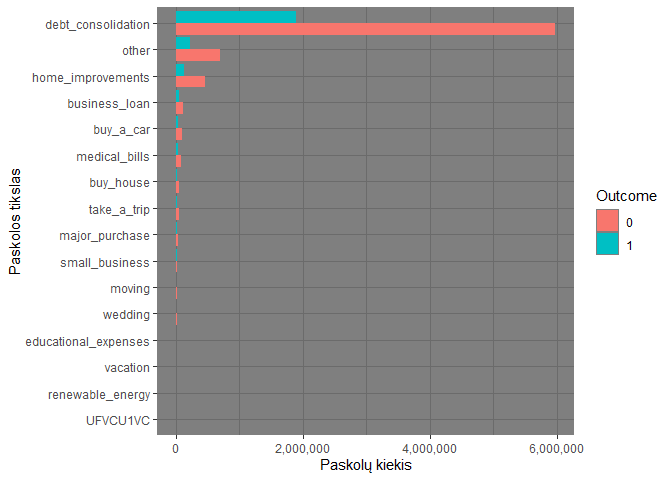
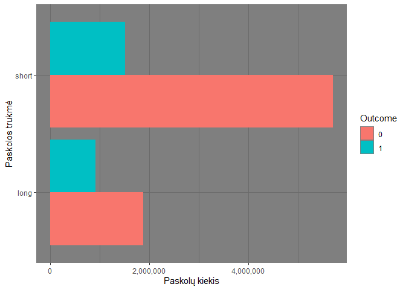
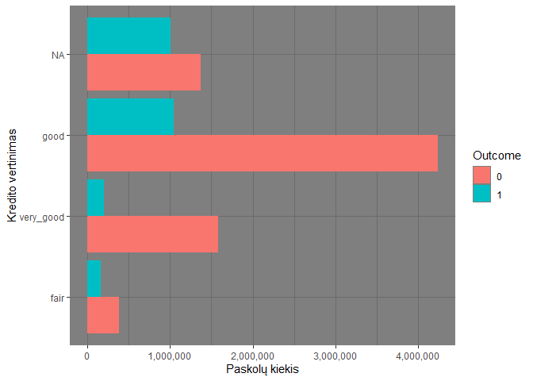
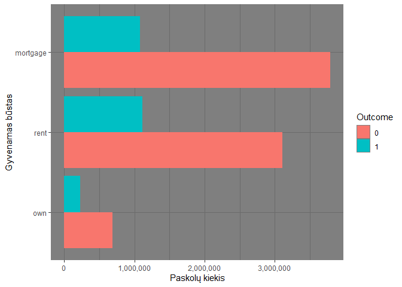

Duomenų failo dimensijos:


```
## [1] 10000000       17
```
# Kintamųjų apžvalga


|   |      id        |y         |amount_current_loan |   term       |   credit_score   |            loan_purpose   |yearly_income     | home_ownership  | bankruptcies |years_current_job | monthly_debt  |years_credit_history |months_since_last_delinquent |open_accounts |credit_problems |credit_balance   |max_open_credit   |
|:--|:---------------|:---------|:-------------------|:-------------|:-----------------|:--------------------------|:-----------------|:----------------|:-------------|:-----------------|:--------------|:--------------------|:----------------------------|:-------------|:---------------|:----------------|:-----------------|
|   |Min.   :1.0e+00 |0:7578593 |Min.   :   10802    |long :2779133 |fair     : 549221 |debt_consolidation:7868889 |Min.   :    76627 |mortgage:4867402 |Min.   :0.000 |Min.   : 0.0      |Min.   :     0 |Min.   : 4.00        |Min.   :  0                  |Min.   : 0.00 |Min.   : 0.0000 |Min.   :       0 |Min.   :0.000e+00 |
|   |1st Qu.:2.5e+06 |1:2421407 |1st Qu.:  179652    |short:7220867 |good     :5287383 |other             : 920066 |1st Qu.:   848844 |own     : 912457 |1st Qu.:0.000 |1st Qu.: 3.0      |1st Qu.: 10200 |1st Qu.:14.00        |1st Qu.: 16                  |1st Qu.: 8.00 |1st Qu.: 0.0000 |1st Qu.:  113297 |1st Qu.:2.771e+05 |
|   |Median :5.0e+06 |NA        |Median :  312312    |NA            |very_good:1785618 |home_improvements : 584493 |Median :  1174371 |rent    :4220141 |Median :0.000 |Median : 6.0      |Median : 16221 |Median :17.00        |Median : 32                  |Median :10.00 |Median : 0.0000 |Median :  210767 |Median :4.726e+05 |
|   |Mean   :5.0e+06 |NA        |Mean   :11765909    |NA            |NA's     :2377778 |business_loan     : 155856 |Mean   :  1378367 |NA               |Mean   :0.117 |Mean   : 5.9      |Mean   : 18471 |Mean   :18.22        |Mean   : 35                  |Mean   :11.15 |Mean   : 0.1736 |Mean   :  297283 |Mean   :7.687e+05 |
|   |3rd Qu.:7.5e+06 |NA        |3rd Qu.:  525096    |NA            |NA                |buy_a_car         : 125140 |3rd Qu.:  1651499 |NA               |3rd Qu.:0.000 |3rd Qu.:10.0      |3rd Qu.: 24012 |3rd Qu.:22.00        |3rd Qu.: 51                  |3rd Qu.:14.00 |3rd Qu.: 0.0000 |3rd Qu.:  370253 |3rd Qu.:7.914e+05 |
|   |Max.   :1.0e+07 |NA        |Max.   :99999999    |NA            |NA                |medical_bills     : 111058 |Max.   :165557393 |NA               |Max.   :7.000 |Max.   :10.0      |Max.   :435843 |Max.   :70.00        |Max.   :176                  |Max.   :76.00 |Max.   :15.0000 |Max.   :32878968 |Max.   :1.540e+09 |
|   |NA              |NA        |NA                  |NA            |NA                |(Other)           : 234498 |NA's   :1919747   |NA               |NA's   :18354 |NA's   :422327    |NA             |NA                   |NA's   :5317819              |NA            |NA              |NA               |NA's   :192       |

Pateikę bendras kintamųjų charakteristikas atskirai apžvelgiame tekstinius kintamuosius:


|loan_purpose         |       n|
|:--------------------|-------:|
|debt_consolidation   | 7868889|
|other                |  920066|
|home_improvements    |  584493|
|business_loan        |  155856|
|buy_a_car            |  125140|
|medical_bills        |  111058|
|buy_house            |   67762|
|take_a_trip          |   55982|
|major_purchase       |   35029|
|small_business       |   27701|
|moving               |   14991|
|wedding              |   11848|
|educational_expenses |   10160|
|vacation             |   10039|
|renewable_energy     |     985|
|UFVCU1VC             |       1|


|term  |       n|
|:-----|-------:|
|short | 7220867|
|long  | 2779133|


|credit_score |       n|
|:------------|-------:|
|good         | 5287383|
|NA           | 2377778|
|very_good    | 1785618|
|fair         |  549221|


|home_ownership |       n|
|:--------------|-------:|
|mortgage       | 4867402|
|rent           | 4220141|
|own            |  912457|

Taip pat atliekame grafinę analizę:

<!-- --><!-- --><!-- --><!-- -->


Daugiausiai bankrotų imant paskolą šiems tikslams:


|loan_purpose       | percentage|
|:------------------|----------:|
|debt_consolidation | 78.3139720|
|other              |  9.0470127|
|home_improvements  |  5.4482786|
|business_loan      |  2.0622308|
|medical_bills      |  1.2720703|
|buy_a_car          |  1.1394615|
|buy_house          |  0.7443193|
|take_a_trip        |  0.5792500|
|small_business     |  0.4413137|
|major_purchase     |  0.4157913|

Daugiausiai tokios trukmės bankrotų:


|term  | percentage|
|:-----|----------:|
|short |   62.55681|
|long  |   37.44319|

Daugiausiai bankrotų su tokiu kredito vertinimu:


|credit_score | percentage|
|:------------|----------:|
|good         |  43.294663|
|NA           |  41.677752|
|very_good    |   8.293567|
|fair         |   6.734019|

Bankrotai pagal gyvenamojo būsto nuosavybės tipą:


|home_ownership | percentage|
|:--------------|----------:|
|rent           |  46.050251|
|mortgage       |  44.624344|
|own            |   9.325405|

Papildomai galime panagrinėti interaktyvias lenteles pagal kiekvieną tekstines reikšmes turintį kintamąjį:


```{=html}
<div class="datatables html-widget html-fill-item-overflow-hidden html-fill-item" id="htmlwidget-3e1a5d5a7a3cbc400409" style="width:100%;height:auto;"></div>
<script type="application/json" data-for="htmlwidget-3e1a5d5a7a3cbc400409">{"x":{"filter":"none","vertical":false,"data":[["1","2","3","4","5","6","7","8","9","10","11","12","13","14","15","16","17","18","19","20","21","22","23","24","25","26","27","28","29","30","31"],["0","0","0","0","0","0","0","0","0","0","0","0","0","0","0","1","1","1","1","1","1","1","1","1","1","1","1","1","1","1","1"],["buy_a_car","buy_house","business_loan","debt_consolidation","educational_expenses","home_improvements","major_purchase","medical_bills","moving","other","renewable_energy","small_business","take_a_trip","vacation","wedding","buy_a_car","buy_house","business_loan","debt_consolidation","educational_expenses","home_improvements","major_purchase","medical_bills","moving","other","renewable_energy","small_business","take_a_trip","UFVCU1VC","vacation","wedding"],[97549,49739,105921,5972589,7635,452568,24961,80256,10697,701001,673,17015,41956,7080,8953,27591,18023,49935,1896300,2525,131925,10068,30802,4294,219065,312,10686,14026,1,2959,2895]],"container":"<table class=\"display\">\n  <thead>\n    <tr>\n      <th> <\/th>\n      <th>y<\/th>\n      <th>loan_purpose<\/th>\n      <th>n<\/th>\n    <\/tr>\n  <\/thead>\n<\/table>","options":{"columnDefs":[{"className":"dt-right","targets":3},{"orderable":false,"targets":0}],"order":[],"autoWidth":false,"orderClasses":false}},"evals":[],"jsHooks":[]}</script>
```


```{=html}
<div class="datatables html-widget html-fill-item-overflow-hidden html-fill-item" id="htmlwidget-b7ae38bdda93ed67abd9" style="width:100%;height:auto;"></div>
<script type="application/json" data-for="htmlwidget-b7ae38bdda93ed67abd9">{"x":{"filter":"none","vertical":false,"data":[["1","2","3","4"],["0","0","1","1"],["long","short","long","short"],[1872481,5706112,906652,1514755]],"container":"<table class=\"display\">\n  <thead>\n    <tr>\n      <th> <\/th>\n      <th>y<\/th>\n      <th>term<\/th>\n      <th>n<\/th>\n    <\/tr>\n  <\/thead>\n<\/table>","options":{"columnDefs":[{"className":"dt-right","targets":3},{"orderable":false,"targets":0}],"order":[],"autoWidth":false,"orderClasses":false}},"evals":[],"jsHooks":[]}</script>
```


```{=html}
<div class="datatables html-widget html-fill-item-overflow-hidden html-fill-item" id="htmlwidget-adbd84586c84f6afe74a" style="width:100%;height:auto;"></div>
<script type="application/json" data-for="htmlwidget-adbd84586c84f6afe74a">{"x":{"filter":"none","vertical":false,"data":[["1","2","3","4","5","6","7","8"],["0","0","0","0","1","1","1","1"],["fair","good","very_good",null,"fair","good","very_good",null],[386163,4239043,1584797,1368590,163058,1048340,200821,1009188]],"container":"<table class=\"display\">\n  <thead>\n    <tr>\n      <th> <\/th>\n      <th>y<\/th>\n      <th>credit_score<\/th>\n      <th>n<\/th>\n    <\/tr>\n  <\/thead>\n<\/table>","options":{"columnDefs":[{"className":"dt-right","targets":3},{"orderable":false,"targets":0}],"order":[],"autoWidth":false,"orderClasses":false}},"evals":[],"jsHooks":[]}</script>
```


```{=html}
<div class="datatables html-widget html-fill-item-overflow-hidden html-fill-item" id="htmlwidget-bc188f0620a7ce162da7" style="width:100%;height:auto;"></div>
<script type="application/json" data-for="htmlwidget-bc188f0620a7ce162da7">{"x":{"filter":"none","vertical":false,"data":[["1","2","3","4","5","6"],["0","0","0","1","1","1"],["mortgage","own","rent","mortgage","own","rent"],[3786865,686651,3105077,1080537,225806,1115064]],"container":"<table class=\"display\">\n  <thead>\n    <tr>\n      <th> <\/th>\n      <th>y<\/th>\n      <th>home_ownership<\/th>\n      <th>n<\/th>\n    <\/tr>\n  <\/thead>\n<\/table>","options":{"columnDefs":[{"className":"dt-right","targets":3},{"orderable":false,"targets":0}],"order":[],"autoWidth":false,"orderClasses":false}},"evals":[],"jsHooks":[]}</script>
```

# Išvados

Įvairiais pjūviais pateikę turimus duomenis visų pirma matome, kad egzistuoja nemažai trūkstamų reikšmių: 

* `yearly_income` iš 10 milijonų reikšmių turi 1.9 milijono NA, arba kitaip 19%, o jau *a priori* žinant, kad gaunamos pajamos yra vienas esminių faktorių paskolos gavimui ar negavimui nuspręsti, galime numanyti, kad ši problema turės nemažą įtaką ir modelio tikslumui. O taip pat ir tiesiog pakeisti šių NA reikšmių kokiais nors pagrįstais skaičiais nepavyks, nes pats kintamasis turi labai didelę variaciją ir keisti paprastu vidurkiu ar mediana nebūtų protinga. Spėjimas, kad NA reikšmės šiuo atveju reiškia, kad klientas tiesiog negauna jokių pajamų per metus, taip pat nepasiteisina - `years_current_job` kintamojo reikšmės yra > 0, todėl tai reikštų, kad klientas turi darbą, bet negauna pajamų. 
* `bankruptcies` - 18,354 NA reikšmių, tai yra vos 0.18% iš visų įrašų, todėl galime numanyti, kad šios trūkstamos reikšmės nesukels didelių problemų.
* `years_current_job` - 422,327 NA reikšmių arba 4.22%. Iš charakteristikų matome, kad šiuo atveju galėtume keisti reikšmes tiek vidurkiu, tiek mediana, abu jie siekia 6, tačiau pats kintamasis vargu ar yra informatyvus paskolos sėkmingumo kontekste, nes jo sklaida yra pakankamai nedidelė, reikšmės pasiskirsčiusios intervale [0:10].
* `months_since_last_delinquent` - net 5,317,819 arba 53.18% NA reikšmių. Tai iš pirmo žvilgsnio suponuoja, kad šis kintamasis yra visai nereikšmingas, nes paprasčiausiai yra tuščias, neturi reikšmių. Tačiau šios NA reikšmės taip pat turi prasmę, nes jei neegzistuoja joks mėnesių kiekis nuo paskutinio atlikto teisės pažeidimo, vadinasi teisės pažeidimai niekada nebuvo fiksuoti ir nagrinėjamas klientas nėra nusikaltęs.
* `max_open_credit` - šis kintamasis turi tik 192 NA reikšmes, o tai sudaro 0.002% visų turimų įrašų, todėl jos modelio tikslumo tikrai neiškraipys.

Žvelgdami detaliau į tekstinius kintamuosius matome, kad klientų paskolų tikslas dažniausiai yra visada tas pats: jau turimų skolų konsolidavimas. Tokių paskolų buvo imama kiek mažiau, nei 8 milijonus kartų, iš kurių 6 milijonai paskolų buvo sėkmingos. Dar nors kiek labiau populiarios paskolos yra namų remontui ir kažkokiam kitam, nedetalizuotam tikslui.

Kalbant apie paskolos trukmę, klientai yra labiau linkę imti trumpalaikes paskolas, tačiau jos yra ir santykinai geresnės, t.y. pasižymi geresniu sėkmingumo rezultatu: jei trumpalaikių paskolų kategorijoje sėkmingumas siekia apie 80%, arba kitaip tariant kas penkta paskola yra nesėkminga, tai ilgalaikių paskolų atveju sėkmingumas yra apie 67% - nesėkminga jau kas trečia paskola. 

Žvelgiant į klientų kredito vertinimus matome, kad daugiausiai paskolų yra suteikiama tiems klientams, kurių kreditingumas yra vertinamas "gerai" ir didžioji dalis tokio vertinimo atitinka savo pavadinimą - iš daugiau nei 5 milijonų "gerai" įvertintų klientų apie 1 milijonas nebuvo sėkmingi. Čia taip pat išsiskiria "labai gerai" įvertintas kreditingumas, vėlgi didžiąja dalimi atitinkantis savo vertinimą, tačiau net ir šioje kategorijoje pasitaikė klaidų: kiek daugiau, nei pusantro milijono paskolų buvo sėkmingos, tačiau apie 200 tūkst. buvo nesėkmingos. Čia taip pat reikėtų atkreipti dėmesį ir į NA reikšmes: tais atvejais, kai kreditingumas nebuvo įvertintas, paskolos sėkmingumas buvo itin mažas, santykinai net mažesnis už "pakankamai" įvertintą kreditingumą: paskolų, kai kreditingumas neįvertintas, buvo išduota 2,37 milijono, o iš jų milijonas paskolų buvo nesėkmingos. Šioje vietoje reikėtų pasiaiškinti, kodėl šiais atvejais kreditingumo vertinimas nebuvo prieinamas ir atkreipti ypatingą dėmesį į tokius atvejus, nes kaip rodo statistika, tokios paskolos yra labai rizikingos.

Galiausiai nagrinėdami kliento gyvenamojo būsto tipo kintamąjį matome, kad, kaip nesunkiai galima ir nuspėti, prasčiausiai pasirodo tie klientai, kurie gyvena nuomojame būste. Tokiems klientams išduotos paskolos buvo 26.4% atvejų nesėkmingos. Antrąją vietą pagal tokį santykinį paskolų nesėkmingumą užima klientai, kurie gyvena nuosavame būste: 24.74% paskolų jiems buvo nesėkmingos. Iš pirmo žvilgsnio atrodytų, kad tokie klientai turėtų būti finansiškai labiausiai atsakingi, tačiau įmanoma ir tai, kad dėl turimo turto per daug pasitiki savo galimybėmis ir neįvertina paskolos rizikos. Na ir mažiausiai rizikinga klientų grupė yra tų, kurių būstas yra įkeistas - šio tipo klientams išduotos paskolos buvo nesėkmingos 22.2% iš visų atvejų.
